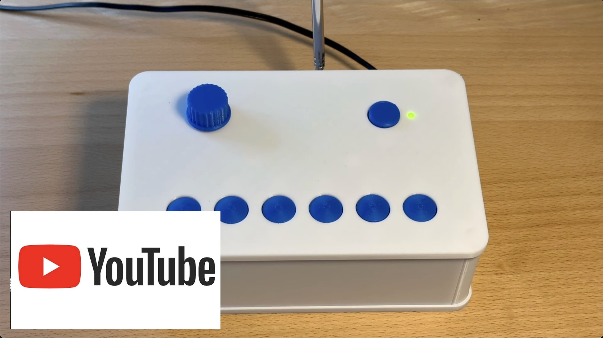

# Minimalist DAB+ radio for the visually impaired

## Abstract: 
An easy to use DAB+ radio for the visually impaired. The radio is configured once using an intuitive web interface. Key components of the device are an Arduino D1 R32 microprocessor board and a DABshield board for radio reception. The radio is very easy to replicate. Full documentation is available on GitHub.

 
  

 

 

## 1. The idea
The radio was developed for a elderly visually impaired lady. The idea was to make the device as easy to use as possible. The preferred radio stations were to be selected once from the large number of DAB+ stations and assigned to 6 station buttons. In addition to these buttons, the on/off switch and the volume control should also be easy to reach with large buttons. A display has been omitted.

 
  

**Figure 1:  Minimalist DAB+ radio.** An easy to use DAB+ radio (not only) for visually impaired.

## 2. Description of the device

Digital Audio Broadcasting (DAB) is a digital radio standard being used predominatly in Europe, but also in Australia, and in parts of Africa and Asia [(Wikipedia)](https://en.wikipedia.org/wiki/Digital_Audio_Broadcasting).

The described radio is based on the DAB+ module [“DABshield”](https://www.dabshield.com), which is controlled by an Arduino microcontroller board “D1 R32”. It has the UNO form factor and can interface with UNO shields. The ESP32 microcontroller monitors 6 station buttons and the volume control. It also has a WiFi module for remote control of the radio.

The radio is housed in a 3D-printed housing (**figure 2**). All mechanical parts were designed with Fusion 360. The electronics are mounted on a carrier PCB (KiCAD). The microcontroller module and the “DABshield” are plugged on top of each other. The switches for the control of the device are also soldered onto the carrier board. This makes the radio easy and uncomplicated to replicate.

 
  

 
  

**Figure 2:  Mechnical setup of the radio.** The top cover serves as chassis of the device. All electronics components are connected through a carrier PCB.

## 3. Operation of the Device and initial setup

The user interface has been reduced to a minimum. In addition to the on/off switch and a volume control, it only consists of 6 station buttons. As the radio is intended for the visually impaired, the haptics of the controls are important.

All settings of the radio, i.e. the programming of the station buttons, the selected station and the volume, are stored in the flash memory of the microcontroller. They are immediately available when the device is switched on.

To program the station buttons in the initial setup, the device is connected to a cell phone or computer via a WiFi connection. If no connection data (SSID and password) of a WiFi network has been stored, the device switches to “Access Point Mode” when it is switched on. In this operating mode, a WiFi network with the SSID “mini_DAB” is created. You can connect to this network without using a password. The user interface is called up with a web browser by entering the address “192.168.4.1” in the address field of the browser.

 
  

**Figure 3:** The **web user interface** allows for device configuration.

The setup screen displays a scrollable list of available DAB+ radio stations. If you select an entry, the radio tunes to the station. Below the station list, the continuous text information of the selected station is displayed.

If the location of the radio has been changed, it is advisable to start a new station search. To do this, click on the corresponding button. The saved station list and the selected assignment of the station buttons will then be deleted. The new station list is automatically saved in the flash memory.

There are 6 assignable station buttons further down. These correspond to the 6 physical buttons on the radio. To assign a station to the buttons, first select it in the station list. Then click and hold on one of the station buttons. The station is then saved for this button.
The volume can also be changed via the website.

As soon as you leave the setup page, the radio works independently with the preset parameters.

## 4. Replicating the radio
All housing parts are 3D printed (**figure 4**). The design data and STL files are available in the GitHub repository. M2 and M3 nuts are inserted into some parts for the mechanical connection of the parts. To insert the nuts, the 3D print must be paused at the correct point in time (**figure5**).

 
  

 
  

**Figure 4: Mechanical parts of the Minimalist DAB+ Radio.** All parts are 3D printed.

 
  
  

**Figure 5: M2 and M3 nuts need to be inserted into the 3D print**

The electronic components are off-the-shelf (**figure 6**). They are listed in the parts list. The only "single source component" is the DAB+ radio module 'DABshield', developed and marketed by the UK company AVIT Research Ltd. [(50 GBP + shipping and handling).](https://www.dabshield.com/store) This module is very reliable and easy to interface with and use.

The carrier board was designed with KiCAD. The project files including the production files are available in the GitHub repository. For the prototype, the board was manufactured by JLCPCB - however, there are numerous alternatives that offer very good quality for relatively little money.

 
  

**Figure 6: The electronics components of the DAB+ Radio**

It is best to start assembling the device by fitting the carrier board. The switch, buttons and LED are mounted on the back of the board. The pin headers for connecting the DABshield and the microcontroller are positioned on the component side. The details can be found in the KiCAD design files. **Figure 7** shows the front and back of the board .

 
  

 
  

**Figure 7: Carrier PCB.** All switches and buttons are soldered to the back side, pin headers for the DABshield are on the component side.

The encoder for the volume setting is mounted on a carrier block. Note the correct position of the 5 pins of the module in the 6-pin socket (**figure 8**).

 
  
  

**Figure 8: Mounting of the encoder for volume control**

The two speakers are connected with a 3.5 mm jack plug. The common pole of the plug is the negative pole (**figure 9**).

 
  

**Figure 9: Two speakers are connected to a 3.5 mm jack plug**

The successive steps for assembling the appliance are shown in Figure 10. The front cover can initially be removed to allow access to the micro-USB socket of the microcontroller module. In this way, the software can be loaded onto the module.

 
  
  

 
  
  

 
  
  

**Figure 10: Successive steps for assembling the DAB+ radio**

## 5. Uploading the software
Although the Arduino IDE could also do the job, I prefer using Visual Studio Code with the platformIO extension. If you do not know this environment, please note, that there are numerous tutorials on Visual Studio Code and platformIO on youTube.

In order to install the software on the DAB+ radio's microcontroller, download a copy of the github repository and store it on your computer, locally. Open the sub-folder “software” in Visual Studio Code (**figure 11**). As all configuration data including the necessary libraries is included in the platformIO.ini file, no further configuration of the software is needed. Connect the Arduino R32 of the radio to your computer using a micro-USB cable. Start the compilation and the data transfer with the check button of the platformIO extension. The program will notify, when the process is completed.

 
  

**Figure 11: Visual Studio Code and platformIO**

However, the software uses a flash disk ("LittleFS"), which includes all web page data (HTML, JS, and CSS files). This data is included in the "data" subfolder of "software". In order to upload the filesystem to the controller, click on the platformIO icon (see picture, click #1) (**figure 12**). Then, click on “Build Filesystem Image” (click #2) to generate the image for the flash disk. Finally, upload the image to the microcontroller with the “Upload Filesystem Image” button (click #3). If the computer does not connect to the microcontroller, it might help to re-sart VS Code.

 
  

 
  

**Figure 12: Uploading the filesystem**

## 6. Conclusions

The minimalist DAB+ radio was developed as an easy-to-use device for the visually impaired. The complexity of the user interface, which is caused by the large variety of DAB+ stations and the wide range of functions of the standard in most devices, was deliberately avoided. A web interface was implemented for setting up the device, which enables the user to conveniently select the desired stations and assign the station buttons.

The radio uses an Arduino microcontroller. The entire software is available for further development and modification. The device is easy to replicate. All mechanical components are 3D-printed. The electronics consist of a carrier board onto which the components are soldered.